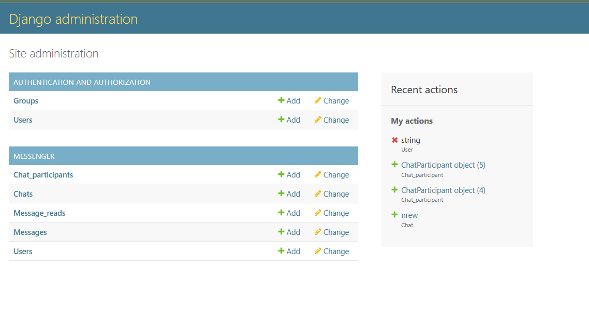
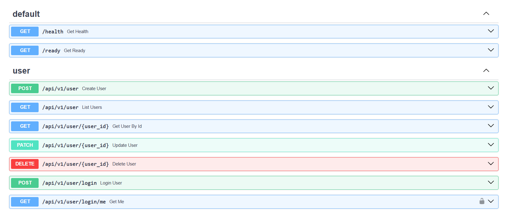
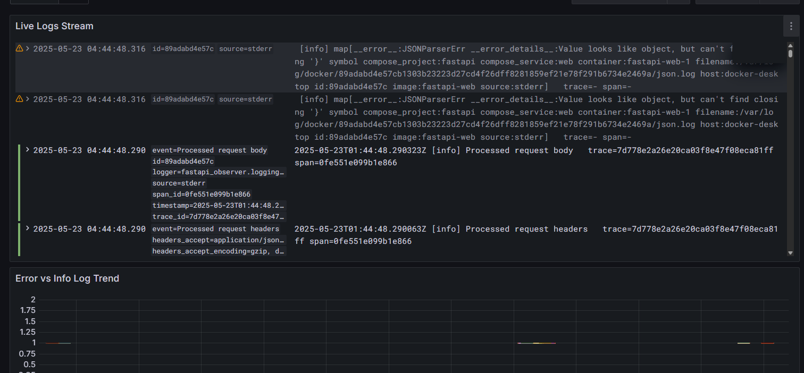
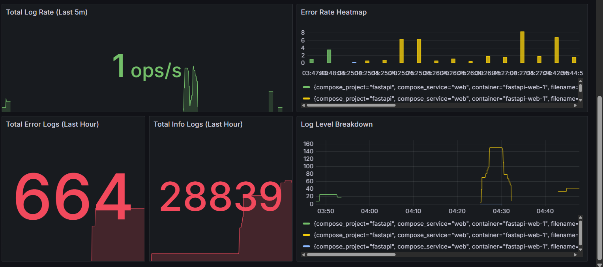
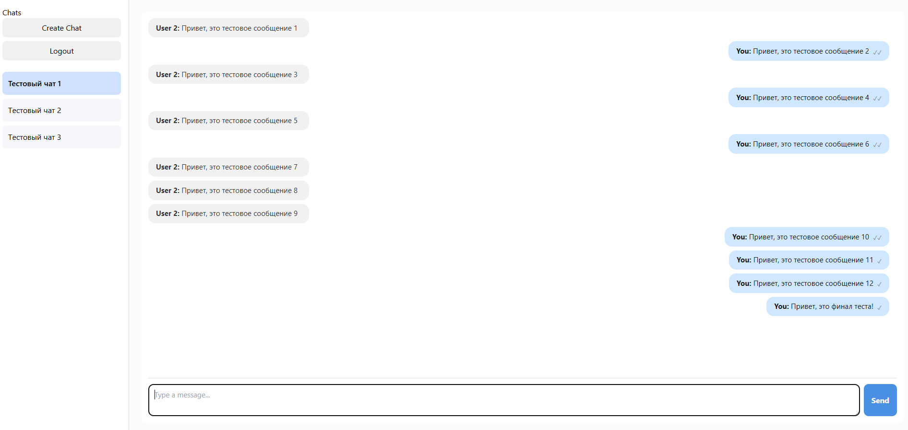
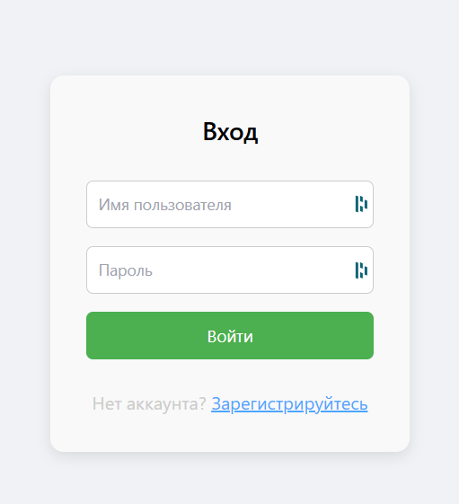
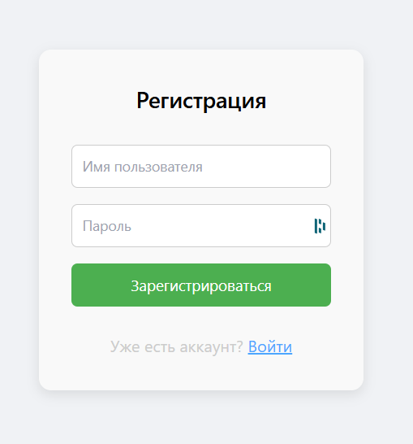

# 📡 Secure Messenger

**Secure Messenger** — это защищённый мессенджер, разработанный для демонстрации дипломного проекта. Он включает в себя:

- **Backend**: Django и FastAPI
- **Frontend**: React
- **Инфраструктура**: Docker Compose
- **Туннелирование**: ngrok
- **Реалтайм**: Centrifugo
- **Мониторинг**: Grafana
- **Логирование**: Loki

## 🧰 Используемый стек

### Backend

- **Django (порт 1024)**: Миграции и административная панель.
- **FastAPI (порт 1026)**: Обработка API-запросов для обмена сообщениями и взаимодействия с базой данных.

### Frontend

- **React (порт 3006)**: Интерфейс пользователя для отправки и получения сообщений в реальном времени.

### Инфраструктура

- **Docker Compose**: Управление многоконтейнерной средой разработки.
- **ngrok (туннелирует порт 8000)**: Создание публичного HTTPS-туннеля к локальному серверу для тестирования и демонстрации.
- **Centrifugo (порт 8000)**: Обеспечивает реалтайм-коммуникацию через WebSocket.
- **Grafana (порт 3000)**: Мониторинг и визуализация метрик системы.

## 🚀 Инструкция по запуску

1. **Клонируйте репозиторий:**

   ```bash
   git clone https://github.com/Max2288/secure-messenger.git
   cd secure-messenger
   ```

2. **Запустите ngrok для проброса порта Centrifugo (8000):**

   ```bash
   ngrok http 8000
   ```

   Сохраните выданный публичный URL для использования в настройках.

3. **Создайте сеть для приложений и установите плагин**

   subnet и gateway укажите свои(их можно узнать через ipconfig || ifconfig в зависимости от системы)
   ```bash
   docker network create \
     --driver=bridge \
     --subnet=10.10.0.0/24 \
     --gateway=10.10.0.1 \
     custom_bridge
   ```
   
   ```bash
   docker plugin install grafana/loki-docker-driver:2.9.4 --alias loki --grant-all-permissions
   ```

4. **Создайте .env файлы в директориях**
   
   backend/django/conf
   backend/fastapi
   
   .env можно целиком скопировать из .env.like(для фастапи заменить урл центрифуги полученный из ngrok)
   
   frontend/my-chat-app
   нужно создать .env .env.local

   **REACT_APP_API_BASE_URL**=http://localhost:1026/api/v1
   **REACT_APP_CENTRIFUGO_WS**=wss://0a22-18-153-55-148.ngrok-free.app/connection/websocket?format=json - **урл для центрифуги заменяем на айпи который выдал ngrok**

   
5. **Запустите сервисы с помощью Docker Compose:**

   ```bash
   cd backend/django
   docker-compose up --build
   ```
   
   
   ```bash
   cd backend/fastapi
   docker-compose up --build
   ```

   Это поднимет контейнеры для Django, FastAPI, Centrifugo и Grafana.

6. **Перейдите в директорию фронтенда и установите зависимости:**

   ```bash
   cd frontend/my-chat-app
   npm install
   ```

7. **Запустите фронтенд в режиме разработки:**

   ```bash
   npm start dev
   ```

   Приложение будет доступно по адресу `http://localhost:3006`.

## 🔗 Эндпоинты

### Django (порт 1024)

- `GET /admin/`: Административная панель Django. (креды admin admin)


### FastAPI (порт 1026)
   Примеры эндпоинтов
- `GET api/v1/message/`: Получение списка сообщений.
- `POST api/v1/message/`: Отправка нового сообщения.
- `GET api/v1/message/{id}/`: Получение конкретного сообщения по ID.
- `GET api/v1/metrics`: Метрики


### Centrifugo (порт 8000, через ngrok)

- Используется для реалтайм-коммуникации через WebSocket.
- Креды для входа можно найти в backend/fastapi/centrifugo/config.json

### Grafana (порт 3000)

- Веб-интерфейс для мониторинга и визуализации метрик системы.
- Есть готовый дашборд, просто перейти на урл и можно будет его посмотреть




### Документация

- Вся документация по проекту находится в папочке docs
- Там присутвует схема базы, система создания ключей шифрования, их обмен
- Доставка сообщений и их схемы


### Пример работы

Общение между 2 пользователями (добавление в чат в левом верхнем углу, оно идет по айди пользователя в примитивной реализации)


Прочитанное сообщение - 2 галочки, отправленное - 1(будет показывать только приобновлении страницы, на фронтенде не проброшен хук на это)

Страница авторизации



Страница регистрации



**Групповой чат можно создать только чреез админку, просто добавить еще 1 участника чата(валидация на privat/group в чатах не стоит)**

**Прочтение сообщений на фронтенде реализовано при нажатии 2 пользователя на поле ввода**

## 📝 Автор

- **Максим Безбородов** — [GitHub](https://github.com/Max2288)

## Благодарность

- Большое спасибо **Даниилу Смирнову** за доступ к библиотеке централизованного мониторинга и форматирования логгирования  — [GitHub](https://github.com/radugaboost)